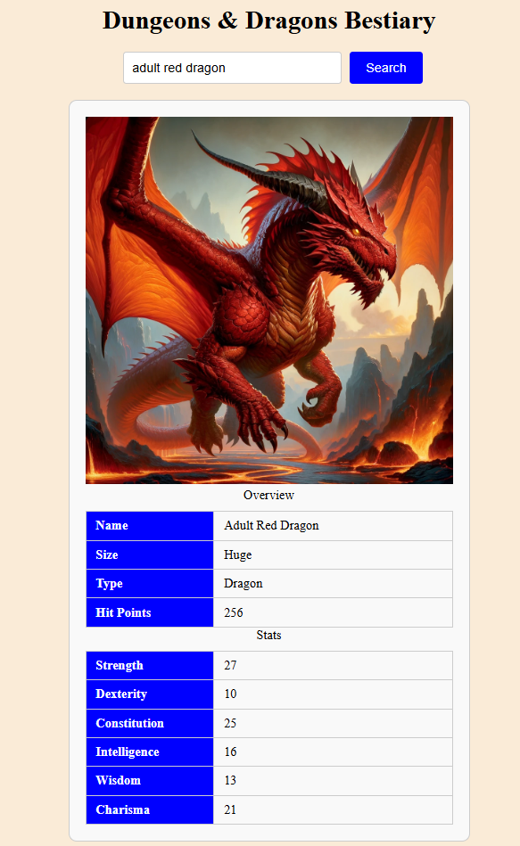
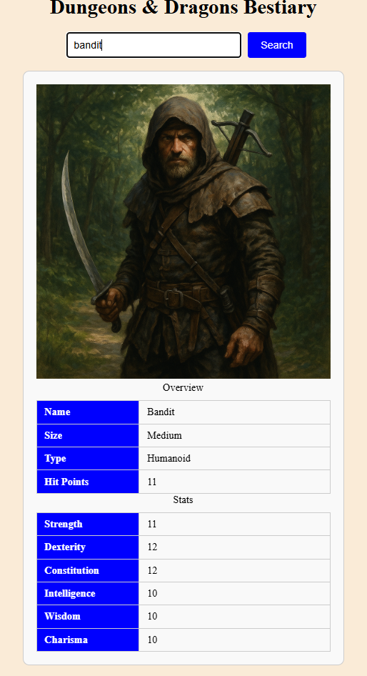

# 🐉 Dungeons and Dragons Monster Lookup
## 📘 Table of Contents
[Overview](#overview)  
[Requirements](#requirements)  
[Screenshots](#screenshots)  
[Learned Concepts](#learned-concepts)  

## ⭐ Overview
This is a web app using the [DND 5e API](https://www.dnd5eapi.com) and node.js to look up basic info   on Dungeons and Dragons monsters.
This includes their creature type, size,   hit points, and stat line (Strength, Dexterity, Consitution, etc.)

## 🔒 Requirements
* node.js
* node.js Express
* Web Browser of your choice

## 📷 Screenshots

## 💡Learned Concepts
* Using Node in tandem with javascript and HTML
* Using external API using JSON\

## 🪶Author Link
[Brayden Hermanson](https://github.com/brherm05)
